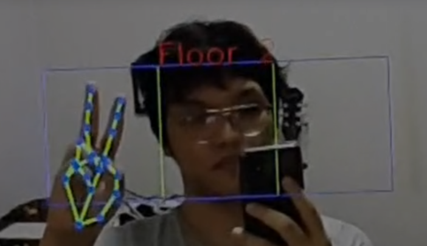
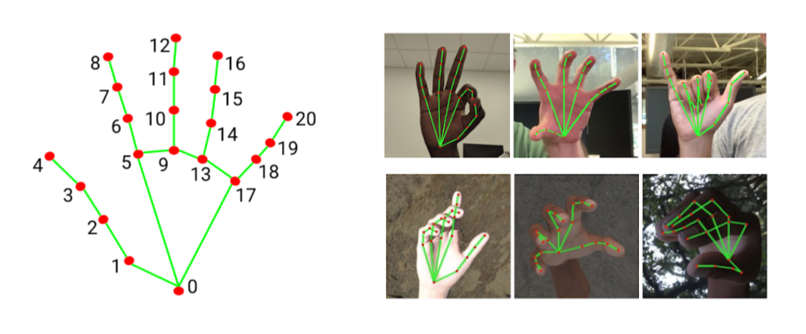
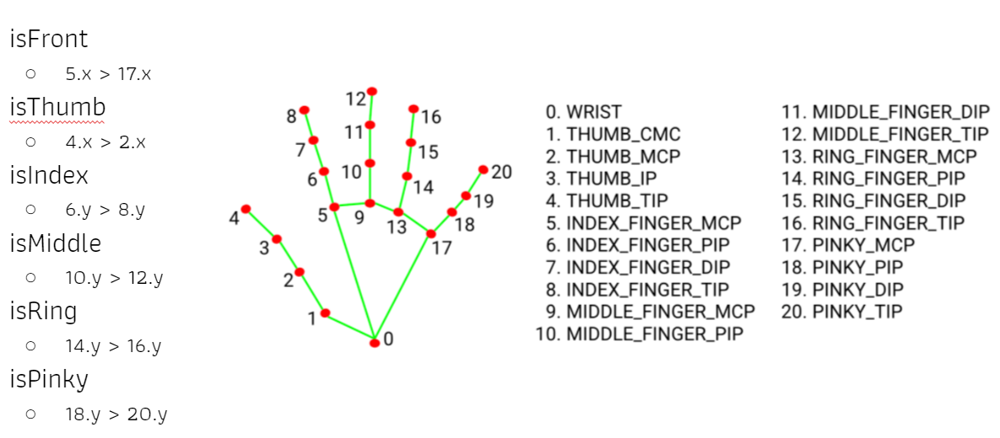

# CV-Final-Project
Hand Gesture Recognition with multiple users for <b>elevator control</b> in covid pandemic situation
<h2>Features</h2>
<ul>
  <li>Real-Time computing</li>
  <li>Handle multiple hands</li>
  <li>Handle more than 10 gestures</li>
</ul>
<h2>Pipeline</h2>
<ul>
  <li>face detection: <a href="https://github.com/cansik/yolo-hand-detection">Yolo v4 tiny</a></li>
  <li>face recognition: <a href="https://github.com/ageitgey/face_recognition">Face_Recognition</a></li>
  <li>hand recognition
    <ul>
      <li>3D landmarks: <a href="https://github.com/google/mediapipe">MediaPipe</a></li>
      <li>gesture recognition: algorithm</li>
    </ul>
  </li>
</ul>

<h2>How does it work?</h2>
<ol>
  <li>To handle multiple users, we decided to use YoloV4Tiny to dedects faces and scale the face areas up to cover their hands. However, handling multiple hands with uncertain positions is very hard. To solve this problem, we expect users to raise their hands beside their faces. So, we can expand the face box to cover their hands easier.
  
  </li>
  <li>We used face recognition to reconize the owner of each hand. This information can be used later for future work.</li>
  <li>Next, MediaPipe is used to draw hand landmarks with the positions of each joint. We can identify the specific joint by the joint number provided in the library. This library is very robust. It can detect the landmarks even though the hand post is very difficult to detect.
  
  </li>
  <li>The Last procedure is gesture recognition algorithm. We use simple algorithm to extract finger information by using the landmark joint positions got from the previous procedure. It's all about a bunch of if-else conditions. Each finger information is extracted first. Then, we combine them to predict the number.
  
  </li>
</ol>
